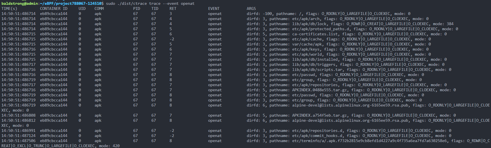

- [项目介绍](#%E9%A1%B9%E7%9B%AE%E4%BB%8B%E7%BB%8D)
  - [项目特点](#%E9%A1%B9%E7%9B%AE%E7%89%B9%E7%82%B9)
- [项目规划](#%E9%A1%B9%E7%9B%AE%E8%A7%84%E5%88%92)
- [Quickstart](#quickstart)
  - [环境准备](#%E7%8E%AF%E5%A2%83%E5%87%86%E5%A4%87)
  - [编译运行](#%E7%BC%96%E8%AF%91%E8%BF%90%E8%A1%8C)
- [功能实现](#%E5%8A%9F%E8%83%BD%E5%AE%9E%E7%8E%B0)
  - [eBPF入门](#ebpf%E5%85%A5%E9%97%A8)
  - [设计与实现](#%E5%8A%9F%E8%83%BD%E8%AE%BE%E8%AE%A1%E4%B8%8E%E5%AE%9E%E7%8E%B0)
    - [概要设计](#%E6%A6%82%E8%A6%81%E8%AE%BE%E8%AE%A1)
    - [cli实现](#cli%E5%AE%9E%E7%8E%B0)
    - [容器行为监控](#%E5%8A%9F%E8%83%BD%E5%AE%9E%E7%8E%B0)
    - [事件输出](#%E4%BA%8B%E4%BB%B6%E8%BE%93%E5%87%BA)
  - [功能测试](#%E5%8A%9F%E8%83%BD%E6%B5%8B%E8%AF%95)
  - [遇到的问题及解决方法](#%E9%81%87%E5%88%B0%E7%9A%84%E9%97%AE%E9%A2%98%E5%8F%8A%E8%A7%A3%E5%86%B3%E6%96%B9%E6%B3%95)
- [团队介绍](#%E5%9B%A2%E9%98%9F%E4%BB%8B%E7%BB%8D)
- [参考引用](#%E5%8F%82%E8%80%83%E5%BC%95%E7%94%A8)


# 项目介绍

ctrace实现了一个基于eBPF的容器跟踪工具和权限最小集分配工具，用于帮助用户跟踪容器行为、防范恶意攻击。它可以跟踪已存在和新开启的容器，收集各类信息并打印或以json文件的形式储存。同时它可以根据容器的行为通过linux系统的seccomp功能自动为容器分配权限最小集。ctrace的主要功能如下：

1.  采集数据：使用Linux系统的eBPF技术对容器进行筛选跟踪与数据采集。
2.  数据存储：将采集获得的数据按一定格式存储到json文件中。
3.  权限最小集分配：使用seccomp技术根据json文件中跟踪到的系统调用来给容器分配权限。

## 项目特点

- 实现353个系统调用+3个rawTracepoint+vfs kprobe

- ctrace并没有采用相对比较成熟的BCC开发模式，而是使用libbpfgo框架进行开发，从而实现了CORE特性，摆脱了对内核版本的依赖（但仍需5.10以上的内核版本），使得eBPF程序的开发可以更加专注于功能本身而不是某个结构/函数是否随内核版本发生了改变。go语言用于用户程序开发也更易与当今云原生主流应用对接。

# 项目规划

| 时间                  | 任务                                          | 达成情况 |
| --------------------- | --------------------------------------------- | -------- |
| 2022/4/20 - 2022/5/2  | 学习eBPF相关知识，确定项目实现方式            | 完成     |
| 2022/5/3 - 2022/5/4   | 搭建项目开发环境                              | 完成     |
| 2022/5/5 - 2022/5/8   | 设计编写程序基础框架                          | 完成     |
| 2022/5/9 - 2022/5/13  | 实现指定跟踪容器功能                          | 完成     |
| 2022/5/14 - 2022/5/15 | 更换项目实现方式为libbpf-go                   | 完成     |
| 2022/5/16 - 2022/5/21 | 实现跟踪容器系统调用功能                      | 完成     |
| 2022/5/22 - 2022/5/26 | 实现跟踪容器文件访问功能                      | 完成     |
| 2022/5/27 - 2022/5/28 | 实现记录跟踪数据存储功能                      | 完成     |
| 2022/5/29 - 2022/6/4  | 过程文档编写完善                              | 完成     |
| 2022/8/1 - 2022/8/2  | 完善时间戳                        | 完成     |
| 2022/8/3 - 2022/8/14 | 实现自动生成seccomp配置文件 | 完成     |

# Quickstart

## 环境准备

- make
- clang-12
- libbpf
- linux-tools-common
- go 1.14+
- kernel version：5.10+

## 编译运行

1. `make build`
2. 运行ctrace，监控容器行为

```bash
# 是否跟踪容器内openat系统调用
sudo ./dist/ctrace trace --event openat
sudo ./dist/ctrace trace --exclude-event openat

# 是否跟踪容器内文件系统、网络、进程相关事件
sudo ./dist/ctrace trace --set fs/net/proc
sudo ./dist/ctrace trace --exclude-set fs/net/proc

# 是否过滤掉容器内进程名为comm的相关事件
sudo ./dist/ctrace trace --comm bash
sudo ./dist/ctrace trace --exclude-comm bash

# 跟踪容器所有系统调用，不跟踪文件系统相关事件
sudo ./dist/ctrace trace --event sys_enter --exclude-set fs

# 跟踪容器内文件系统相关事件，过滤掉read事件
sudo ./dist/ctrace trace --set fs  --exclude-event read

# 跟踪容器所有系统调用，不跟踪文件系统相关事件，只跟踪bash进程
sudo ./dist/ctrace trace --exclude-set fs --comm bash

# 实现docker ps，列出正在运行的容器
sudo ./dist/ctrace trace ls -c
```



3. config配置输出

```bash
# 设置输出格式为json或table
sudo ./dist/ctrace config --set output-format=json

# 设置输出文件路径，不设置则输出到终端屏幕
sudo ./dist/ctrace config --set events-path=~/ctrace_output/events.json

# 设置错误事件输出文件路径
sudo ./dist/ctrace config --set errors-path=~/ctrace_output/error.json
```

```json
json输出如下：
{
    "timestamp": 29197306126,       //时间戳
    "processId": 14891,             //进程ID
    "threadId": 14891,              //线程ID
    "parentProcessId": 14876,       //父进程ID
    "userId": 0,                    //用户ID
    "mountNamespace": 4026532760, 
    "pidNamespace": 4026532763,
    "processName": "cat",
    "hostName": "f1d4bd003923",     //容器ID
    "eventId": "257",               //事件ID
    "eventName": "openat",          //事件名称
    "argsNum": 4,                   //参数个数
    "returnValue": 3,
    "args": [
        {
            "name": "dirfd",
            "type": "int",
            "value": -100
        },
        {
            "name": "pathname",    //打开的文件名
            "type": "const char*",
            "value": "hello_ctrace"
        },
        {
            "name": "flags",
            "type": "unsigned int",
            "value": "O_RDONLY"
        },
        {
            "name": "mode",
            "type": "mode_t",
            "value": 0
        }
    ]
}
```


# 功能实现

目录结构说明：

```bash
.
├── command
│   ├── common.go              //global flags/action
│   ├── config.go              //cli config命令
│   └── trace.go               //trace命令
├── config
│   └── config.go              //读写配置文件
├── ctrace
│   ├── argprinters.go         //参数打印
│   ├── bpf                    //bpf.c
│   │   ├── common.bpf.h
│   │   ├── ctrace.bpf.c
│   │   ├── ctrace.bpf.h
│   │   ├── missing_defines.h
│   │   └── vmlinux.h
│   ├── consts.go              //枚举事件，参数类型
│   ├── container.go           //容器相关实现
│   ├── ctrace.go			         //ctrace主体功能
│   ├── events_amd64.go        //枚举事件常量定义
│   ├── external.go            //事件定义与json输出
│   └── printer.go             //事件打印
├── conf.yaml                  //ctrace配置文件
├── go.mod
├── go.sum
├── main.go
├── Makefile
```

## eBPF入门

[eBPF入门](./doc/eBPF入门.md)

## 设计与实现

### 概要设计

通过阅读eBPF相关文章、学习类似项目经验，我们决定使用libbpf-go作为ctrace的实现方式。首先编写eBPF程序跟踪记录内核中各个进程进行的系统调用和文件访问等行为，分别对其编写函数并进行相应处理。随后根据cgroup id将容器进程挑选出来，再通过eBPF Map将采集到的信息传递给用户空间程序进一步的处理。用户程序则负责格式化打印储存event信息、跟踪选项设置、容器权限配置等功能的实现。程序架构如下所示：


### cli实现

[cli实现](./doc/cli实现.md)

### 容器行为监控

[容器对文件的访问、系统调用、容器互访](./doc/功能实现.md)

### 事件输出

[事件输出](./doc/事件输出.md)

## 功能测试

[功能测试](./doc/功能测试.md)


## 遇到的问题及解决方法

[遇到的问题及解决方法](./doc/遇到的问题及解决方法.md)

# 团队介绍

企业导师：程泽睿志（华为）

学校导师：吴松（华中科技大学）

成员：洪涛、郭永强、吴浩

# 参考引用

- [aquasecurity/tracee: Linux Runtime Security and Forensics using eBPF (github.com)](https://github.com/aquasecurity/tracee)
- [Linux内核调试技术——kprobe使用与实现](https://blog.csdn.net/luckyapple1028/article/details/52972315)
- [BPF之路一bpf系统调用](https://www.anquanke.com/post/id/263803)
- [BPF的可移植性和CO-RE (Compile Once – Run Everywhere）](https://www.cnblogs.com/charlieroro/p/14206214.html)
