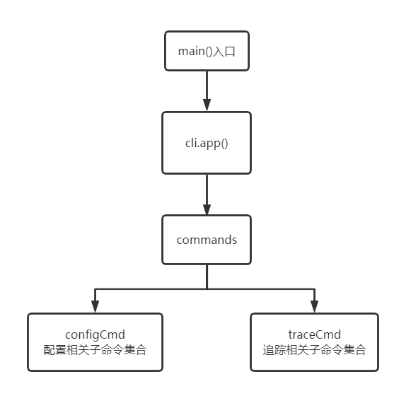

- [cli实现](#cli%E5%AE%9E%E7%8E%B0)
  - [架构设计](#%E6%9E%B6%E6%9E%84%E8%AE%BE%E8%AE%A1)
  - [具体实现](#%E5%85%B7%E4%BD%93%E5%AE%9E%E7%8E%B0)

# cli实现

## 架构设计
cli的实现主要采用了Go的`urfave/cli`工具



## 具体实现
项目的CLI入口为main.go中的main()方法
```go
func main() {
	app := &cli.App{
		Name:                   "ctrace",
		Usage:                  "Trace containers using eBPF",
		Version:                "v0.0.1",
		UseShortOptionHandling: true,
		Flags:                  command.GlobalOptions,
		Action:                 command.GlobalAction,
		Commands:               command.Commands,
	}
	if !isCapable() {
		log.Fatal("Not enough privileges to run this program")
	}

	err := app.Run(os.Args)
	if err != nil && err != command.ErrPrintAndExit {
		log.Fatal(err)
	}
}
```

其中`commands`包含定义好的子命令集，每个子命令集对应一个文件，使整体架构更为清晰。
```Go
var Commands = []*cli.Command{
	configCmd,
	traceCmd,
	// more subcommands ...
}
```

configCmd中定义与配置文件相关的指令，包括更改配置、恢复默认配置、打印配置、将读出来的配置加载到软件主题对象中等

```go
var configCmd = &cli.Command{
	Name:  "config",
	Usage: "set ctrace config",
	Flags: []cli.Flag{
		&cli.StringFlag{
			Name:  "set",
			Usage: "set config item",
		},

		&cli.StringFlag{
			Name:  "unset",
			Usage: "unset config item",
		},
	},
    ...
}
```

traceCmd中定义与主要追踪功能相关的指令，也是最为重要的业务指令，包括容器对系统的具体系统调用的追踪、容器对文件访问的追踪、容器列表的打印等

```go
var traceCmd = &cli.Command{
	Name:  "trace",
	Usage: "trace containers",
	Flags: []cli.Flag{
		&cli.StringSliceFlag{
			Name:    "event",
			Aliases: []string{"e"},
			Value:   nil,
			Usage:   "trace only the specified event or syscall. use this flag multiple times to choose multiple events",
		},
		&cli.StringSliceFlag{
			Name:  "exclude-event",
			Value: nil,
			Usage: "exclude an event from being traced. use this flag multiple times to choose multiple events to exclude",
		},
        ...
    }
    ...
}
```

