- [eBPF入门（整理中...）](#ebpf%E5%85%A5%E9%97%A8%E6%95%B4%E7%90%86%E4%B8%AD)
- [架构、工作原理](#%E6%9E%B6%E6%9E%84%E5%B7%A5%E4%BD%9C%E5%8E%9F%E7%90%86)
  - [](#)
- [基础知识](#%E5%9F%BA%E7%A1%80%E7%9F%A5%E8%AF%86)
  - [kprobes](#kprobes)
  - [ELF文件格式](#elf%E6%96%87%E4%BB%B6%E6%A0%BC%E5%BC%8F)
    - [跟踪不同的编程语言](#%E8%B7%9F%E8%B8%AA%E4%B8%8D%E5%90%8C%E7%9A%84%E7%BC%96%E7%A8%8B%E8%AF%AD%E8%A8%80)
- [常见eBPF程序类型](#%E5%B8%B8%E8%A7%81ebpf%E7%A8%8B%E5%BA%8F%E7%B1%BB%E5%9E%8B)
  - [跟踪类](#%E8%B7%9F%E8%B8%AA%E7%B1%BB)
    - [追踪：tracepoint、kprobe/uprobe、USDT](#%E8%BF%BD%E8%B8%AAtracepointkprobeuprobeusdt)
    - [收集：**ftrace、**perf_event、eBPF](#%E6%94%B6%E9%9B%86ftraceperf_eventebpf)
    - [system call](#system-call)
  - [网络类](#%E7%BD%91%E7%BB%9C%E7%B1%BB)
    - [**XDP（eXpress Data Path，高速数据路径）程序**](#xdpexpress-data-path%E9%AB%98%E9%80%9F%E6%95%B0%E6%8D%AE%E8%B7%AF%E5%BE%84%E7%A8%8B%E5%BA%8F)
    - [**TC（Traffic Control）程序**](#tctraffic-control%E7%A8%8B%E5%BA%8F)
    - [**套接字程序**](#%E5%A5%97%E6%8E%A5%E5%AD%97%E7%A8%8B%E5%BA%8F)
    - [**cgroup 程序**](#cgroup-%E7%A8%8B%E5%BA%8F)
- [程序组成](#%E7%A8%8B%E5%BA%8F%E7%BB%84%E6%88%90)
  - [程序三要素](#%E7%A8%8B%E5%BA%8F%E4%B8%89%E8%A6%81%E7%B4%A0)
  - [LLVM 工具查看eBPF bytecode](#llvm-%E5%B7%A5%E5%85%B7%E6%9F%A5%E7%9C%8Bebpf-bytecode)
- [💻编程接口](#%E7%BC%96%E7%A8%8B%E6%8E%A5%E5%8F%A3)
  - [语法](#%E8%AF%AD%E6%B3%95)
    - [**BPF_PERF_OUTPUT**](#bpf_perf_output)
  - [BPF钩子](#bpf%E9%92%A9%E5%AD%90)
    - [系统调用](#%E7%B3%BB%E7%BB%9F%E8%B0%83%E7%94%A8)
  - [BPF map](#bpf-map)
  - [辅助函数](#%E8%BE%85%E5%8A%A9%E5%87%BD%E6%95%B0)
    - [查找辅助函数](#%E6%9F%A5%E6%89%BE%E8%BE%85%E5%8A%A9%E5%87%BD%E6%95%B0)
  - [libbpf编译](#libbpf%E7%BC%96%E8%AF%91)
  - [BTF](#btf)
  - [CORE](#core)
- [Linux namespace](#linux-namespace)
- [查询列表](#%E6%9F%A5%E8%AF%A2%E5%88%97%E8%A1%A8)
  - [当前系统支持的辅助函数](#%E5%BD%93%E5%89%8D%E7%B3%BB%E7%BB%9F%E6%94%AF%E6%8C%81%E7%9A%84%E8%BE%85%E5%8A%A9%E5%87%BD%E6%95%B0)
  - [HASH映射](#hash%E6%98%A0%E5%B0%84)
  - [SEC宏](#sec%E5%AE%8F)
- [libbpf-boostrap](#libbpf-boostrap)
- [资料](#%E8%B5%84%E6%96%99)
  - [入门](#%E5%85%A5%E9%97%A8)

# eBPF入门（整理中...）

- 跟踪（trace）：基于事件驱动
- 采样（sampling）：每隔一段时间采样一次，比跟踪开销小， 因为相当于抽样
- 可观测性（observability）：是指通过全面观测来理解一个系统。可观测性工具包括跟踪工具、采样工具、基于固定计数器的工具，但不包括benchmark工具，因为benchmark会改变系统状态。

- 用户空间 API（user space API for applications） `libbpf`。这是一个 C 库，接管了所有加载工作，这样用户就不需要自己处理复杂的加载过程了。
- CO-RE（Compile-Once Run-Everywhere，一次编译，到处运行）
  - BTF：BPF 类型格式，它提供结构信息以避免Clang 和内核头文件依赖。
  - CO-RE：它使已编译的BPF 字节码可重定位，从而避免了LLVM 重新编译的需要。LLVM 和Clang编译后的结果是一个轻量级的ELF 二进制文件，其中包含预编译的BPF 字节码，并且可以在任何地方运行。BCC 项目中的大部分工具已经完成基于CO-RE 的重写。
- fast path：快速收发包路径
- 从低版本到高版本的兼容性可以用CO-RE解决（CO-RE只在新版本内核才支持），而反过来就需要在eBPF内部加上额外的代码来处理了。比如根据内核版本作条件编译，低版本内核执行不同的逻辑。

# 架构、工作原理

- 尽管 eBPF 程序在内核态运行，但是跟 kernel module 不一样，eBPF 程序不能调用普通内核 export 出来的函数，而是只能调用在内核中为 eBPF 事先定义好的一些接口函数。这些接口函数叫作 BPF Helpers（BPF辅助函数）


> eBPF 使用与cBPF 相同，都是基于事件驱动架构。 eBPF 触发的钩子点可以为： 
> •用户空间代码的调用 
> •内核例程在特定内存地址的执行 
> •网络数据包的到达或者数据包流转路径上 
> •系统调用 
> •...... 
> 在触发点条件满足时，则会触发eBPF 程序的运行。

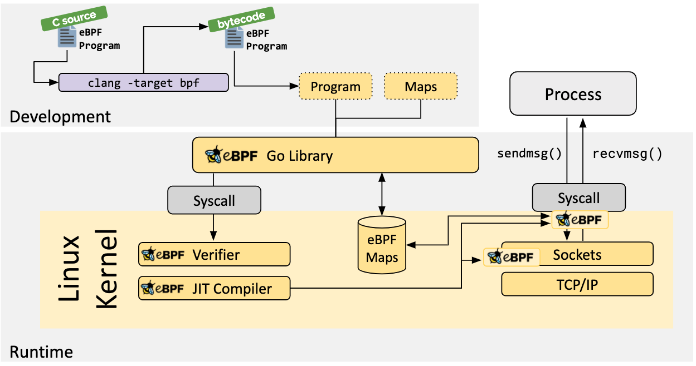

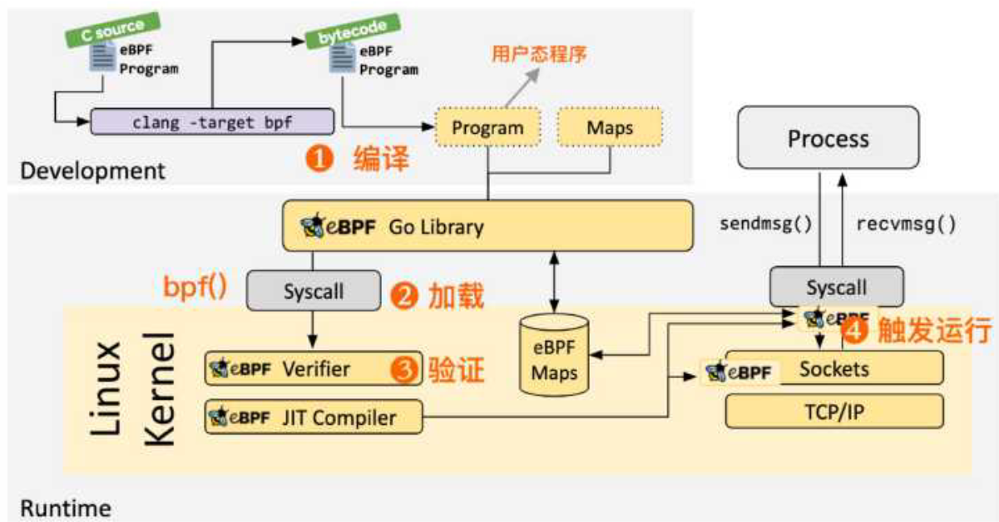

1. 编译：我们可以使用 LLVM 或者 GCC 工具将编写的 eBPF 代码程序编译成 eBPF 字节码； 

2. 加载：然后使用加载程序 Loader 通过 bpf() 系统调用将字节码加载至内核； 

3. 验证：内核使用验证器（Verfier） 组件保证执行字节码的安全性，以避免对内核造成灾难，在 确认字节码安全后将其加载对应的内核模块执行；

   验证过程：

    •首先进行深度优先搜索，禁止循环；其他 CFG 验证。

    •以上一步生成的指令作为输入，遍历所有可能的执行路径。具体说 就是模拟每条指令的执行，观察寄存器和栈的状态变化。 

4. 触发运行：在内核对应事件触发时，运行的 eBPF 字节码程序，可通过 map 或者 perf_event 与用户态程序进行数据交互

5. 当编写完成BPF程序后，首先会通过clang生成LLVM IR文件，然后再经过LLVM生成BPF字节码。字节码经过加载器通过`bpf()`系统调用（注意从这里开始由用户态进入了内核态）进入验证器验证，最后通过JIT执行。

6. eBPF程序指令都是在内核的特定插桩点执行，将指令加载到内核时，内核会创建bpf_prog存储指令，然后将bpf_prog和内核中的插桩点进行关联，当插桩点被访问到时执行这些指令。

7. 举个例子，以kprobe为例，首先kprobe会复制保存原来的目标地址，然后使用int3或者jmp指令替换掉它，当程序控制流执行到断点时，检查如果由kprobe替换的，则执行kprobe相关指令，然后再执行原来的程序。当kprobe程序停止时，再把原来的目标地址拷贝回去，来恢复现场。

## 

# 基础知识

## kprobes

> [Linux内核调试技术——kprobe使用与实现_luckyapple1028的博客-CSDN博客_kprobes](https://blog.csdn.net/luckyapple1028/article/details/52972315)

kprobes技术包括的3种探测手段分别时

- kprobe：首先kprobe是最基本的探测方式，是实现后两种的基础，它可以在任意的位置放置探测点（就连函数内部的某条指令处也可以）。它提供了探测点的调用前、调用后和内存访问出错3种回调方式，分别是pre_handler、post_handler和fault_handler，其中pre_handler函数将在被探测指令被执行前回调，post_handler会在被探测指令执行完毕后回调（注意不是被探测函数），fault_handler会在内存访问出错时被调用；
- jprobe：jprobe基于kprobe实现，它用于获取被探测函数的入参值
- kretprobe：kernel return probe 用于获取被探测函数的返回值。
- 

用户空间定义的静态跟踪点（User Statically Defined Tracing，简称 USDT）

## ELF文件格式

- [ELF 文件格式 · Linux Inside 中文版 (gitbooks.io)](https://xinqiu.gitbooks.io/linux-inside-zh/content/Theory/linux-theory-2.html)

### 跟踪不同的编程语言

1. 第一类是 C、C++、Golang 等编译为机器码后再执行的编译型语言。这类编程语言开发的程序，通常会**编译成 ELF 格式的二进制文件**，包含了**保存在寄存器或栈中的函数参数和返回值**，因而可以直接**通过二进制文件中的符号进行跟踪**。

2. 第二类是 Python、Bash、Ruby 等通过解释器语法分析之后再执行的解释型语言。这类编程语言开发的程序，无法直接从语言运行时的二进制文件中获取应用程序的调试信息，通常需要跟踪解释器的函数，再从其参数中获取应用程序的运行细节。

   查看python USDT 跟踪点：`sudo bpftrace -l '*:/usr/bin/python3:*'`

3. 最后一类是 Java、.Net、JavaScript 等先编译为字节码，再由即时编译器（JIT）编译为机器码执行的即时编译型语言。同解释型语言类似，这类编程语言无法直接从语言运行时的二进制文件中获取应用程序的调试信息。跟踪 JIT 编程语言开发的程序是最困难的，因为 JIT 编译的状态只存在于内存中。

不过需要注意的是，大部分编译型语言遵循 `ABI（Application Binary Interface）` 调用规范，函数的参数和返回值都存放在寄存器中。而 Go 1.17 之前使用的是 `Plan 9` 调用规范，函数的参数和返回值都存放在堆栈中；直到 1.17， Go 才从 Plan 9 切换到 ABI调用规范。

# 常见eBPF程序类型

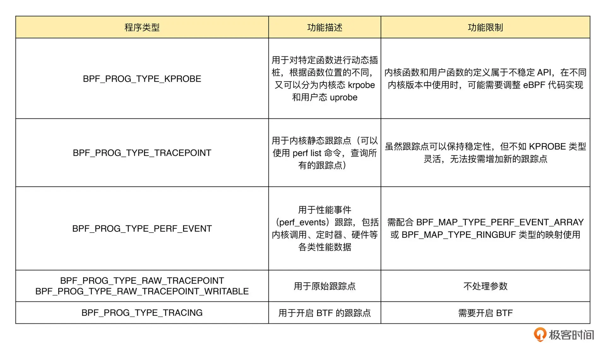

## 跟踪类

probe用来跟踪内核态/用户态函数，tracepoint用来跟踪定义在内核特殊位置点

### 追踪：tracepoint、kprobe/uprobe、USDT

**tracepoint**

“tracepoint” 是一种编译到你的程序中的东西。当使用程序的人，想要看看 tracepoint 什么时候命中及提取数据的时候，他们可以先"启用"或"激活" tracepoint 。通常，在 tracepoint 没有被激活的时候不会产生任何额外的开销，甚至在它被激活的时候开销也是相当的低。

kprobe可以在内核几乎任意地方注入代码, 但同时内核在固定位置也预埋了一些tracepoint, 这些tracepoint往往是精心挑选的, 即使对该模块了解不多的人, 通过tracepoint也能有个大致了解. 一般来说, 内核函数的变动比较频繁, tracepoint则相对稳定.

**kprobe/uprobe**

**USDT**

“USDT 探针” 和 “dtrace 探针"是一个东西，是用户版的tracepoint

### 收集：**ftrace、**perf_event、eBPF

1. Ftrace 支持从Kprobes、Tracepoints、Uprobes收集数据。

2. 从内核中获取数据的第二种方法，是使用 `perf_event_open` 系统调用。原理是：

   1. 调用 `perf_event_open` 系统调用
   2. 内核写把事件到一个在用户空间的环形缓冲区中，应用程序可以从中读取数据

   我知道的唯一的一件事情是，你可以以这种方式读取 tracepoints。这也就是执行 `sudo perf trace` 命令时做的事情（每个系统调用都有一个 tracepoints）

3. eBPF工作原理

   1. 你写一段 “eBPF 程序”（通常是 C 语言，或者用一种生成这种程序的工具）
   2. 要求内核把探针附着到 kprobe/uprobe/tracepoint/dtrace 探针
   3. “eBPF 程序"把数据输出到一个 eBPF map/ftrace/perf 缓冲区
   4. 你拥有了自己的数据！

### system call

[eBPF 对于系统调用的底层支持采用的是 kprobe 机制](https://www.ebpf.top/post/ebpf_trace_file_open/)，用户空间所有的BPF相关函数, 归根结底都是对于bpf系统调用的包装

查看内核所有系统调用：[syscall_64.tbl - arch/x86/entry/syscalls/syscall_64.tbl - Linux source code (v5.18-rc6) - Bootlin](https://elixir.bootlin.com/linux/v5.18-rc6/source/arch/x86/entry/syscalls/syscall_64.tbl)

- [Linux 系统动态追踪技术介绍 | arstercz’s blog](https://blog.arstercz.com/introduction_to_linux_dynamic_tracing/)
- [译｜2017｜Linux 追踪系统&如何组合在一起的 – Blog (jayce.github.io)](https://jayce.github.io/public/posts/trace/linux-tracing-system-fit-together/)

## 网络类

### **XDP（eXpress Data Path，高速数据路径）程序**

XDP 程序的类型定义为 BPF_PROG_TYPE_XDP，它在网络驱动程序刚刚收到数据包时触发执行，支持卸载到网卡硬件。由于无需通过繁杂的内核网络协议栈，XDP 程序可用来实现高性能的网络处理方案，常用于 DDoS 防御、防火墙、4 层负载均衡等场景。

### **TC（Traffic Control）程序**

在网卡队列接收或发送的时候触发执行，运行在内核协议栈中，常用于流量控制；

### **套接字程序**

在套接字发生创建、修改、收发数据等变化的时候触发执行，运行在内核协议栈中，常用于过滤、观测或重定向套接字网络包。其中，BPF_PROG_TYPE_SOCK_OPS、BPF_PROG_TYPE_SK_SKB、BPF_PROG_TYPE_SK_MSG 等都可以用于套接字重定向；

套接字 eBPF 程序工作在内核空间中，无需把网络数据发送到用户空间就能完成转发。使用套接字映射转发网络包需要以下几个步骤：

1. 创建套接字映射
2. 在 BPF_PROG_TYPE_SOCK_OPS 类型的 eBPF 程序中，将新创建的套接字存入套接字映射中；
3. 在流解析类的 eBPF 程序（如 BPF_PROG_TYPE_SK_SKB 或BPF_PROG_TYPE_SK_MSG ）中，从套接字映射中提取套接字信息，并调用 BPF 辅助函数转发网络包；
4. 加载并挂载 eBPF 程序到套接字事件。

### **cgroup 程序**

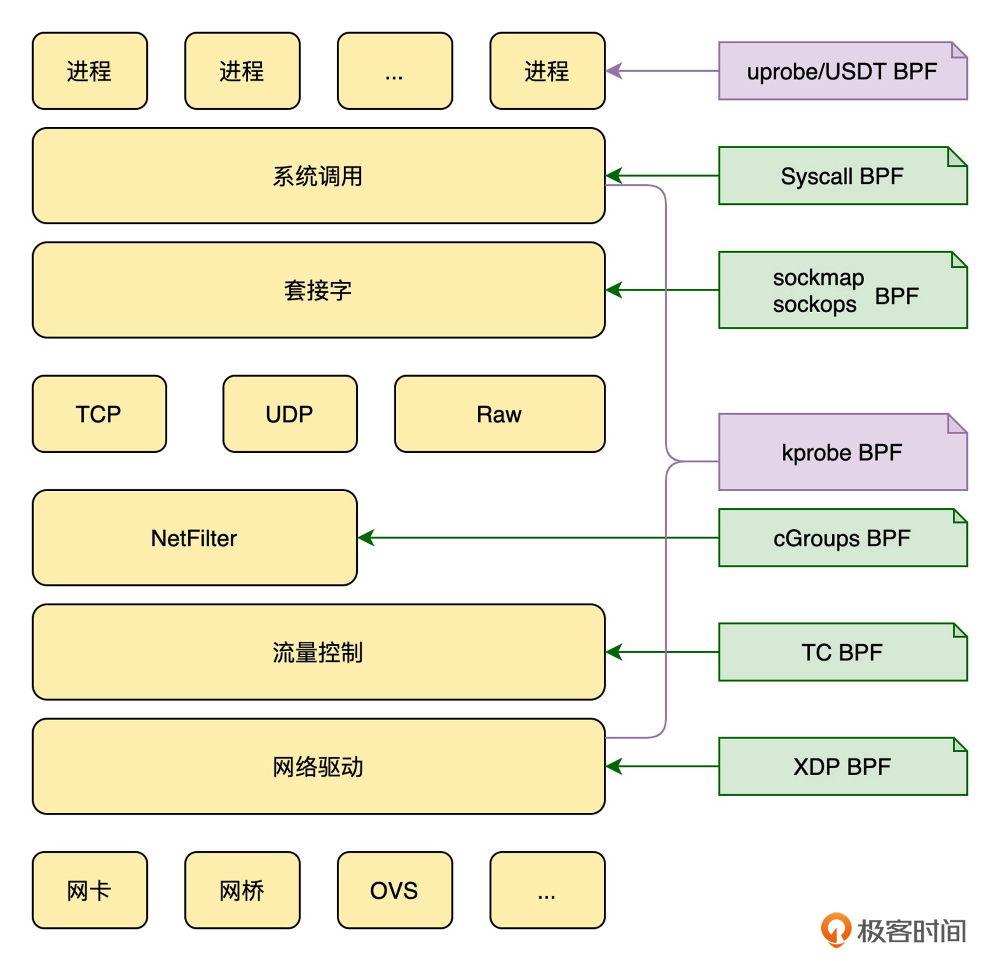

# 程序组成

eBPF 程序的高层次组件：

- **后端**：这是在内核中加载和运行的 eBPF 字节码。它将数据写入内核 map 和环形缓冲区的数据结构中；
- **加载器**：它将字节码后端加载到内核中。通常情况下，当加载器进程终止时，字节码会被内核自动卸载；
- **前端**：从数据结构中读取数据（由后端写入）并将其显示给用户；
- **数据结构**：这些是后端和前端之间的通信手段。它们是由内核管理的 map 和环形缓冲区，可以通过文件描述符访问，并需要在后端被加载之前创建，数据会持续存在，直到没有更多的后端或前端进行读写操作；

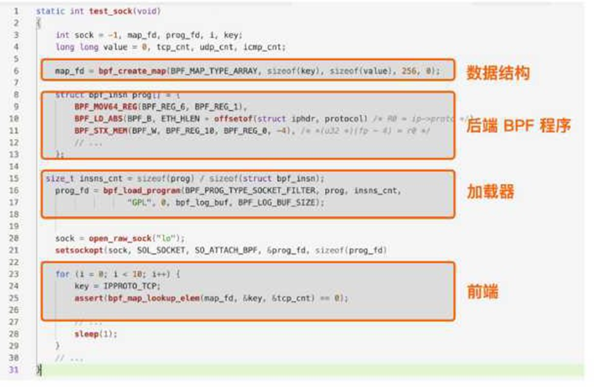

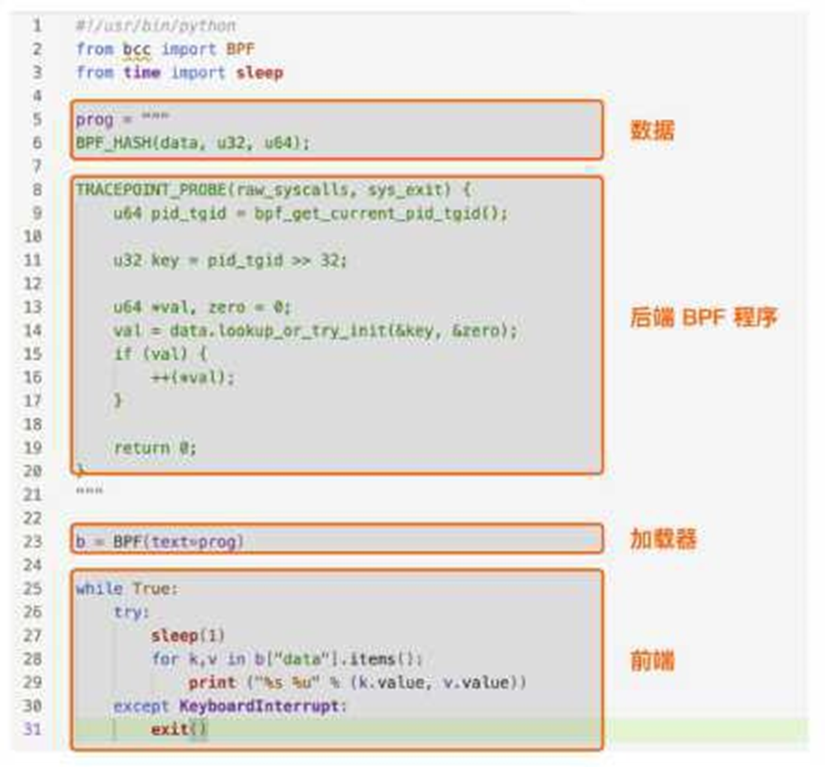

## 程序三要素

eBPF Program Types 可以定义函数在 eBPF 内核态的类型。

eBPF Maps 定义了key/value 对的存储结构，搭建了 eBPF Program 之间以及用户态和内核态之间的数据交换的桥梁。

eBPF Helpers 是内核事先定义好了接口函数，方便 eBPF 程序调用这些函数。

## LLVM 工具查看eBPF bytecode

- 用objdump来查看bpf_program.o里的汇编指令

`llvm-objdump -D src/bpf_program.o`

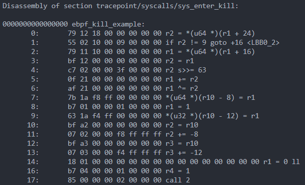

- 用readelf读到bpf_program.o中的ELF section信息。

`llvm-readelf -sections src/bpf_program.o`

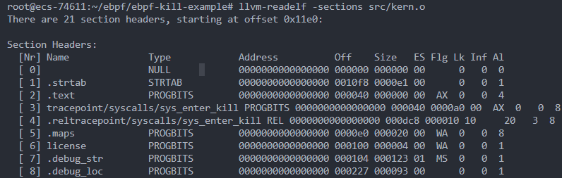

# 💻编程接口

man bpf翻译：[BPF之路一bpf系统调用 - 安全客，安全资讯平台 (anquanke.com)](https://www.anquanke.com/post/id/263803)

## 语法

### **BPF_PERF_OUTPUT**

来定义一个 Perf 事件类型的 BPF 映射，使用`perf_submit()` 把数据提交到BPF 映射

```go
在 BCC 中，与 eBPF 程序中 BPF_PERF_OUTPUT 相对应的用户态辅助函数是open_perf_buffer() 。它需要传入一个回调函数，用于处理从 Perf 事件类型的 BPF映射中读取到的数据，

b["events"].open_perf_buffer(print_event)
while 1:
try:
	b.perf_buffer_poll()
except KeyboardInterrupt:
	exit()

open_perf_buffer 定义了名为 “events” 的 Perf 事件映射，而后通过
一个循环调用 perf_buffer_poll 读取映射的内容，并执行回调函数输出进程信息。
```

## BPF钩子

```bash
# 查询所有内核插桩和跟踪点
sudo bpftrace -l
# 使用通配符查询所有的系统调用跟踪点
sudo bpftrace -l 'tracepoint:syscalls:*'
# 使用通配符查询所有名字包含"execve"的跟踪点
sudo bpftrace -l '*execve*'
```

### 系统调用

事件包括系统调用

```c
#include <linux/bpf.h>
int bpf(int cmd, union bpf_attr *attr, unsigned int size);
第一个，cmd ，代表操作命令，比如上一讲中我们看到的 BPF_PROG_LOAD 就是加载eBPF 程序；
第二个，attr，代表 bpf_attr 类型的 eBPF 属性指针，不同类型的操作命令需要传入不同的属性参数；
第三个，size ，代表属性的大小。
```

查看内核所有系统调用：`sudo cat /sys/kernel/debug/tracing/events/syscalls`

如果目录不存在，则挂载一下：`sudo mount -t debugfs debugfs /sys/kernel/debug`

**syscall**

[6.3.11. syscall — 二进制安全学习笔记 1.0.0 文档 (binhack.readthedocs.io)](https://binhack.readthedocs.io/zh/latest/os/linux/syscall/index.html)

- `do_sys_openat2()` 是系统调用 `openat()` 在内核中的实现
- execve() ：fork一个子进程，在子进程中调用exec函数启动新的程序。

## BPF map

HASH映射用于不同跟踪点直接数据共享，性能事件映射用于用户空间获取跟踪点数据

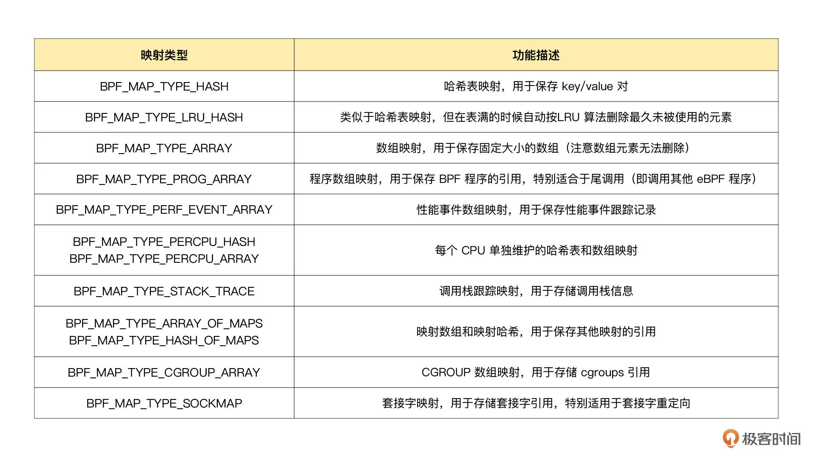

```c
BPF_HASH(name, key_type=u64,leaf_type=u64, size=10240)
// 使用默认参数
BPF_HASH(stats);

// 使用自定义key类型，保持默认 leaf_type=u64, size=10240
struct key_t {
	char c[80];
};
BPF_HASH(counts, struct key_t);

// 自定义所有参数
BPF HASH(cpu time, uint64 t, uint64 t, 4096);
```

BPF 系统调用中并没有删除映射的命令，这是因为 BPF 映射会在用户态程序关闭文件描述符的时候自动删除（即close(fd) ）。如果你想在程序退出后还保留映射，就需要调用 BPF_OBJ_PIN 命令，将映射挂载到/sys/fs/bpf 中。

## 辅助函数

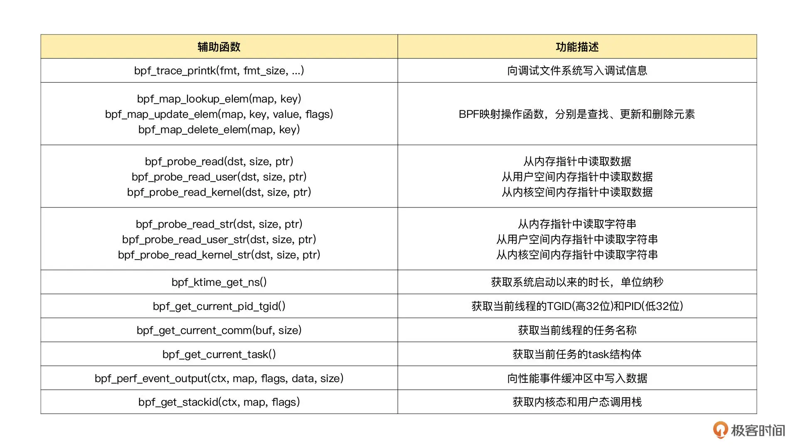

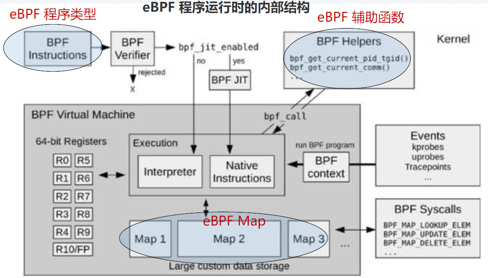

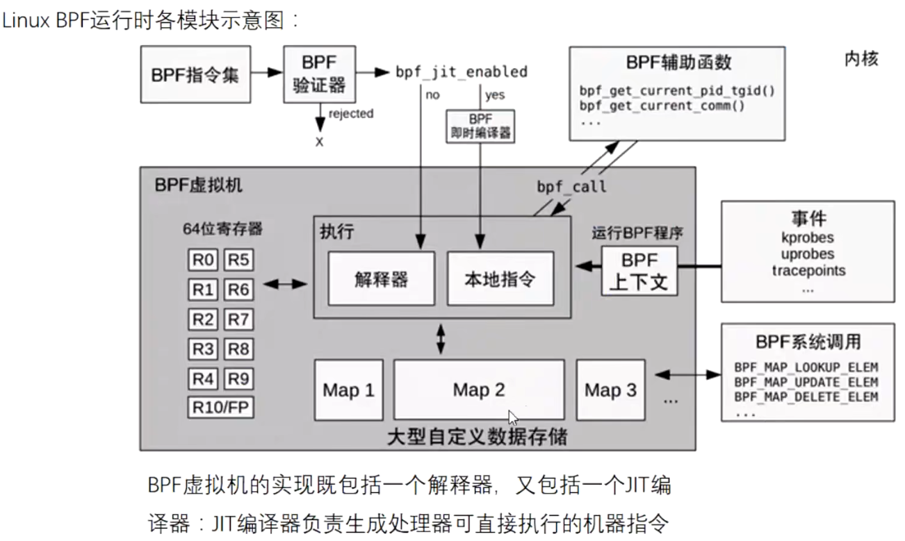

由于eBPF 程序不能随意调用内核函数，因此内核专门提供eBPF 程序可以调用的辅助函数。

辅助函数与内核版本对应关系参见：[bcc/kernel-versions.md at master · iovisor/bcc (github.com)](https://github.com/iovisor/bcc/blob/master/docs/kernel-versions.md)

### 查找辅助函数

1. **[reference_guide](https://github.com/iovisor/bcc/blob/master/docs/reference_guide.md)**，常用的、推荐的都列在里面了，必读。
2. **[bpf.h](https://github.com/torvalds/linux/blob/f40ddce8/include/uapi/linux/bpf.h)**。
3. `bpftool feature probe`，这个命令也可以查看所有支持的辅助函数。

## libbpf编译

• [https://github.com/libbpf/libbpf/blob/master/src/bpf_helpers.h](https://github.com/libbpf/libbpf/blob/master/src/bpf_helpers.h)

该头文件中定义了一些常用的宏，比如`SEC`宏声明段的名称，`__always_inline`宏声明内联代码，`__uint`、`__type`和`__array`使用btf功能。

1. 开发 eBPF 程序，并把源文件命名为 <程序名>.bpf.c；
2. 编译 eBPF 程序为字节码，然后再调用 bpftool gen skeleton 为 eBPF 字节码生成脚手架头文件;
3. 开发用户态程序，引入生成的脚手架头文件后，加载 eBPF 程序并挂载到相应的内核事件中。

第二步就是开发 eBPF 程序，包括定义哈希映射、性能事件映射以及跟踪点的处理函数等，而对这些数据结构和跟踪函数的定义都可以通过 SEC() 宏定义来完成。在编译时，通过 SEC() 宏定义的数据结构和函数会放到特定的 ELF 段中，这样后续在加载 BPF 字节码时，就可以从这些段中获取所需的元数据。

## BTF

：之前使用bpf_probe_read时需要知道内核数据结构才能从正确的内存地址中取到数据，采用引入大量内核头文件，不同内核的头文件路径及其数据结构不同，虽然在程序中重新定义数据结构可以暂时解决这个问题，但是也很容易把使用旧内核数据结构的eBPF程序带入新内核导致不能运行。

BPF 类型格式（BPF Type Format, BTF）的诞生正是为了解决这些问题。从内核 5.2 开始，只要开启了CONFIG_DEBUG_INFO_BTF，在编译内核时，内核数据结构的定义就会自动内嵌在内核二进制文件 vmlinux 中。并且，你还可以借助下面的命令，把这些数据结构的定义导出到一个头文件中（通常命名为 vmlinux.h）：`bpftool btf dump file /sys/kernel/btf/vmlinux format c > vmlinux.h`

[【译】BTFGen: 让 eBPF 程序可移植发布更近一步 | 深入浅出 eBPF](https://www.ebpf.top/post/btfgen-one-step-closer-to-truly-portable-ebpf-programs/)

## CORE

：解决了内核数据结构的定义问题，接下来的问题就是，如何让 eBPF 程序在内核升级之后，不需要重新编译就可以直接运行。

借助了 BTF 提供的调试信息，再通过下面的两个步骤，使得 eBPF 程序可以适配不同版本的内核：

1. 通过对 BPF 代码中的访问偏移量进行重写，解决了不同内核版本中数据结构偏移量不同的问题；
2. 在 libbpf 中预定义不同内核版本中的数据结构的修改，解决了不同内核中数据结构不兼容的问题。

对于旧版本的内核，虽然它们不会再去内置 BTF 的支持，但开源社区正在尝试通过 BTFHub 等方法，为它们提供 BTF 调试信息。

- [BPF的可移植性和CO-RE (Compile Once – Run Everywhere） - charlieroro - 博客园 (cnblogs.com)](https://www.cnblogs.com/charlieroro/p/14206214.html)

# Linux namespace

`pid_ns_for_children`指向该进程的子进程会使用的`pid_namespace`

```c
static __always_inline u32 get_task_pid_ns_id(struct task_struct* task) {
    return task->nsproxy->pid_ns_for_children->ns.inum;
}

struct pid_namespace {
	struct idr idr;
	struct rcu_head rcu;
	unsigned int pid_allocated;
	struct task_struct *child_reaper;
	struct kmem_cache *pid_cachep;
	unsigned int level;
	struct pid_namespace *parent;
#ifdef CONFIG_BSD_PROCESS_ACCT
	struct fs_pin *bacct;
#endif
	struct user_namespace *user_ns;
	struct ucounts *ucounts;
	int reboot;	/* group exit code if this pidns was rebooted */
	struct ns_common ns;
} __randomize_layout;

struct ns_common {
	atomic_long_t stashed;
	const struct proc_ns_operations *ops;
	unsigned int inum;
	refcount_t count;
};
```

# 查询列表

## 当前系统支持的辅助函数

`bpftool feature probe`

`man bpf-helpers` 或include/uapi/linux/bpf.h，有它们的详细定义

## HASH映射

`bpftool feature probe | grep map_type`

## SEC宏

[https://github.com/libbpf/libbpf/blob/master/src/libbpf.c#:~:text=static const struct bpf_sec_def section_defs[] %3D {](https://github.com/libbpf/libbpf/blob/master/src/libbpf.c#:~:text=static%20const%20struct%20bpf_sec_def%20section_defs%5B%5D%20%3D%20%7B)

# libbpf-boostrap

[Building BPF applications with libbpf-bootstrap (nakryiko.com)](https://nakryiko.com/posts/libbpf-bootstrap/#libbpf-bootstrap-overview)

# 资料

[why's blog (whysdomain.com)](https://blog.whysdomain.com/blog/427/)

[eBPF Tracing 入门教程与实例-阿里云开发者社区 (aliyun.com)](https://developer.aliyun.com/article/810447)

[ebpf user-space probes 原理探究 (edony.ink)](https://www.edony.ink/deep-in-ebpf-uprobe/)

[eBPF - Hi~Roy! (hi-roy.com)](https://www.hi-roy.com/categories/ebpf/)

[Linux超能力BPF技术介绍及学习分享（附PPT） – My X Files (davidlovezoe.club)](https://davidlovezoe.club/wordpress/archives/1122)

[ebpf - 随笔分类 - charlieroro - 博客园 (cnblogs.com)](https://www.cnblogs.com/charlieroro/category/1878938.html)

[Articles (cn-zh) (arthurchiao.art)](https://arthurchiao.art/articles-zh/)

[eBPF技术介绍 - 刘达的博客 (imliuda.com)](https://imliuda.com/post/1047)

[eBPF编程指北 (qq.com)](https://mp.weixin.qq.com/s?__biz=MzI1OTY2MzMxOQ==&mid=2247499983&idx=1&sn=b39f8d896abd76bf20e2f00fba25b99d&chksm=ea77f477dd007d6182536eae2d449000686bcb083f1c1a44f32fc3560d620f8eedd495fbb756&mpshare=1&scene=23&srcid=0504hBLmQ4IAzh41QU8idu5R&sharer_sharetime=1651629114111&sharer_shareid=0d0549c2b7737766aaa735707689e90c#rd)

- [(10条消息) bcc Reference Guide 中文翻译_JinRong.Liang的博客-CSDN博客_bcc检查的方法](https://blog.csdn.net/qq_34258344/article/details/108155481)
- [通过eBPF实现对Linux内核的灵活扩展 - 记事本 (rk700.github.io)](http://rk700.github.io/2021/10/11/ebpf-introduction/)
- [eBPF学习计划 – My X Files (davidlovezoe.club)](https://davidlovezoe.club/wordpress/archives/862)
- [eBPF 系列三：eBPF map | 一朵浊浪映天地 (vvl.me)](https://vvl.me/2021/02/eBPF-3-eBPF-map/)
- [绿色记忆:eBPF学习笔记 (gmem.cc)](https://blog.gmem.cc/ebpf)
- 英文原版书在线版：[BPF Performance Tools: Linux System and Application Observability (ebookreading.net)](https://ebookreading.net/detail/book/EB9780136588870)

## 入门

- [Linux 内核监测技术 eBPF - beihai blog (wingsxdu.com)](https://wingsxdu.com/posts/linux/ebpf/)