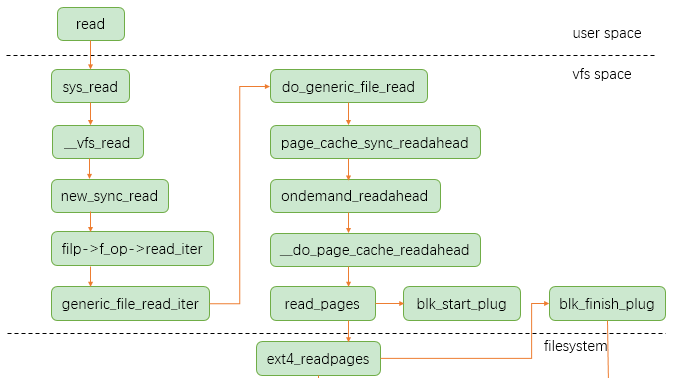
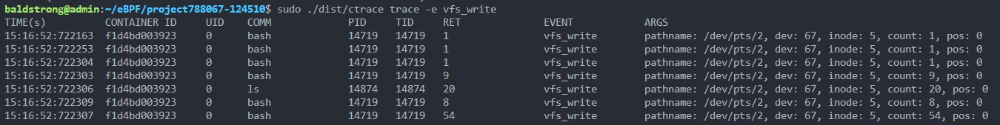

- [容器对系统的调用](#%E5%AE%B9%E5%99%A8%E5%AF%B9%E7%B3%BB%E7%BB%9F%E7%9A%84%E8%B0%83%E7%94%A8)
  - [1. 枚举需要监控的系统调用](#1-%E6%9E%9A%E4%B8%BE%E9%9C%80%E8%A6%81%E7%9B%91%E6%8E%A7%E7%9A%84%E7%B3%BB%E7%BB%9F%E8%B0%83%E7%94%A8)
  - [2. 为系统调用编写通用锚点函数](#2-%E4%B8%BA%E7%B3%BB%E7%BB%9F%E8%B0%83%E7%94%A8%E7%BC%96%E5%86%99%E9%80%9A%E7%94%A8%E9%94%9A%E7%82%B9%E5%87%BD%E6%95%B0)
  - [3. 判断是否是来自容器的系统调用](#3-%E5%88%A4%E6%96%AD%E6%98%AF%E5%90%A6%E6%98%AF%E6%9D%A5%E8%87%AA%E5%AE%B9%E5%99%A8%E7%9A%84%E7%B3%BB%E7%BB%9F%E8%B0%83%E7%94%A8)
- [容器对文件的访问](#%E5%AE%B9%E5%99%A8%E5%AF%B9%E6%96%87%E4%BB%B6%E7%9A%84%E8%AE%BF%E9%97%AE)
  - [vfs_write原理](#vfs_write%E5%8E%9F%E7%90%86)
  - [bpf实现](#bpf%E5%AE%9E%E7%8E%B0)
  - [效果](#%E6%95%88%E6%9E%9C)
- [容器之间的互访](#%E5%AE%B9%E5%99%A8%E4%B9%8B%E9%97%B4%E7%9A%84%E4%BA%92%E8%AE%BF)
- [参考引用](#%E5%8F%82%E8%80%83%E5%BC%95%E7%94%A8)

# 容器对系统的调用

## 1. 枚举需要监控的系统调用

`ctrace`将每一个系统调用以枚举的形式保存到`consts.go`文件中

每一项包括系统调用的ID(枚举变量)、系统调用的名称、系统调用对应`eBpf`的锚点类型、系统调用所属的类别(基本系统调用类、文件相关类、进程相关类、网络相关类等)

枚举的节选如下所示：

```go
var EventsIDToEvent = map[int32]EventConfig{
	ReadEventID:                {ID: ReadEventID, ID32Bit: sys32read, Name: "read", Probes: []probe{{event: "read", attach: sysCall, fn: "read"}}, Sets: []string{"syscalls", "fs", "fs_read_write"}},
	WriteEventID:               {ID: WriteEventID, ID32Bit: sys32write, Name: "write", Probes: []probe{{event: "write", attach: sysCall, fn: "write"}}, Sets: []string{"syscalls", "fs", "fs_read_write"}},
	OpenEventID:                {ID: OpenEventID, ID32Bit: sys32open, Name: "open", Probes: []probe{{event: "open", attach: sysCall, fn: "open"}}, Sets: []string{"default", "syscalls", "fs", "fs_file_ops"}},
	CloseEventID:               {ID: CloseEventID, ID32Bit: sys32close, Name: "close", Probes: []probe{{event: "close", attach: sysCall, fn: "close"}}, Sets: []string{"default", "syscalls", "fs", "fs_file_ops"}},
	StatEventID:                {ID: StatEventID, ID32Bit: sys32stat, Name: "stat", Probes: []probe{{event: "newstat", attach: sysCall, fn: "newstat"}}, Sets: []string{"default", "syscalls", "fs", "fs_file_attr"}},
	FstatEventID:               {ID: FstatEventID, ID32Bit: sys32fstat, Name: "fstat", Probes: []probe{{event: "newfstat", attach: sysCall, fn: "newfstat"}}, Sets: []string{"default", "syscalls", "fs", "fs_file_attr"}},
	LstatEventID:               {ID: LstatEventID, ID32Bit: sys32lstat, Name: "lstat", Probes: []probe{{event: "newlstat", attach: sysCall, fn: "newlstat"}}, Sets: []string{"default", "syscalls", "fs", "fs_file_attr"}},
	PollEventID:                {ID: PollEventID, ID32Bit: sys32poll, Name: "poll", Probes: []probe{{event: "poll", attach: sysCall, fn: "poll"}}, Sets: []string{"syscalls", "fs", "fs_mux_io"}},
	LseekEventID:               {ID: LseekEventID, ID32Bit: sys32lseek, Name: "lseek", Probes: []probe{{event: "lseek", attach: sysCall, fn: "lseek"}}, Sets: []string{"syscalls", "fs", "fs_read_write"}},
	MmapEventID:                {ID: MmapEventID, ID32Bit: sys32mmap, Name: "mmap", Probes: []probe{{event: "mmap", attach: sysCall, fn: "mmap"}}, Sets: []string{"syscalls", "proc", "proc_mem"}},
    ...
}
```

## 2. 为系统调用编写通用锚点函数

如果为每一个系统调用编写`eBpf`锚点函数，工程量大且重复工作多，好在可以通过锚点`sys_enter`与`sys_exit`，`sys_enter`和`sys_exit`指令是 Pentium® II 处理器上引入的“快速系统调用”工具的一部分，为ring 0和ring 3直接实现快速切换。在进入系统调用之前保存系统调用的参数，在系统调用之后将调用信息保存到`ebpf Map`中，同时根据系统调用的ID对特殊的系统调用进行处理

```go
SEC("raw_tracepoint/sys_enter")
int tracepoint__raw_syscalls__sys_enter(struct bpf_raw_tracepoint_args* ctx) {
    struct args_t args_tmp = {};
    struct task_struct* task = (struct task_struct*)bpf_get_current_task();
    int id = ctx->args[1];
    ...
}

SEC("raw_tracepoint/sys_exit")
int tracepoint__raw_syscalls__sys_exit(struct bpf_raw_tracepoint_args* ctx) {
    int id;
    long ret;
    struct task_struct* task = (struct task_struct*)bpf_get_current_task();
    struct pt_regs* regs = (struct pt_regs*)ctx->args[0];
    id = READ_KERN(regs->orig_ax);
    ret = ctx->args[1];
    ...
}
```

## 3. 判断是否是来自容器的系统调用

获取当前进程`ns_pid`，如果`ns_pid == 1`，则说明此进程为容器进程，将其保存到追踪列表中，以便于筛选我们所需要的系统调用信息。

```c
static __always_inline u32 add_container_pid_ns() {
    struct task_struct* task;
    task = (struct task_struct*)bpf_get_current_task();

    u32 pid_ns = get_task_pid_ns_id(task);
    if (bpf_map_lookup_elem(&containers_map, &pid_ns) != 0)
        // Container pidns was already added to map
        return pid_ns;

    // If pid equals 1 - start tracing the container
    if (get_task_ns_pid(task) == 1) {
        // A new container/pod was started - add pid namespace to map
        bpf_map_update_elem(&containers_map, &pid_ns, &pid_ns, BPF_ANY);
        return pid_ns;
    }

    // Not a container/pod
    return 0;
}

static __always_inline int should_trace() {
    context_t context = {};
    init_context(&context);
    // do not trace ctrace itself
    if (get_config(CONFIG_TRACEE_PID) == context.host_pid) {
        return 0;
    }    
    //trace existed containers or new containers
    u32 cgroup_id_lsb = context.cgroup_id;
    if(bpf_map_lookup_elem(&existed_containers_map, &cgroup_id_lsb)==0 && 
        bpf_map_lookup_elem(&containers_map, &context.pid_id) == 0){
        return 0;        
    }
    ...
    return 1;
}
```

如果容器在`ctrace`运行前以及存在，则通过扫描`proc/mounts`文件查看`cgroups`挂载点，在`/sys/fs/cgroup`目录获取现有容器id，将其保存到`eBpf map`中，在`eBpf`函数中，通过`map`将对应的进程添加到追踪列表中。

```go
func (c *Containers) PopulateContainersBpfMap(bpfModule *bpf.Module) error {
	containersMap, err := bpfModule.GetMap("existed_containers_map")
	if err != nil {
		return err
	}
	for cgroupIdLsb, info := range c.cgroups {
		if info.ContainerId != "" {
			state := containerExisted
			err = containersMap.Update(cgroupIdLsb, state)
			log.Println("cgroupIdLsb:", cgroupIdLsb)
		}
	}
	return err
}
```


# 容器对文件的访问

## vfs_write原理

类比vfs_read的调用流程：



用户空间的write函数在内核里面的服务例程为sys_write，sys_write内部调用了vfs_write来完成写操作，

```c
// 把用户空间的char __user* buf指向的内存地址里面的内容写入相应的设备文件
ssize_t ksys_write(unsigned int fd, const char __user *buf, size_t count)
{
	struct fd f = fdget_pos(fd);
	ssize_t ret = -EBADF;

	if (f.file) {
		loff_t pos, *ppos = file_ppos(f.file);
		if (ppos) {
			pos = *ppos;
			ppos = &pos;
		}
		ret = vfs_write(f.file, buf, count, ppos);
		if (ret >= 0 && ppos)
			f.file->f_pos = pos;
		fdput_pos(f);
	}

	return ret;
}
```

## bpf实现

```c

static __always_inline int do_vfs_write_writev(struct pt_regs* ctx, u32 event_id, u32 tail_call_id) {
    1. 初始化buffer、context
    2. 拿到设备id, 文件inode, 和offset
    3. 将参数保存到buffer中
    4. events_perf_submit
	return 0;
}

SEC("kprobe/vfs_write")
TRACE_ENT_FUNC(vfs_write, VFS_WRITE);

SEC("kretprobe/vfs_write")
int BPF_KPROBE(trace_ret_vfs_write) {
    return do_vfs_write_writev(ctx, VFS_WRITE, TAIL_VFS_WRITE);
}
```

## 效果



# 容器之间的互访

根据事件参数（网络地址、文件路径等）判断是否访问其他容器，如果是的话，则注明目的容器（未完成）


# 参考引用

- [Linux 编程中的API函数和系统调用的关系-up哥小号-ChinaUnix博客](http://blog.chinaunix.net/uid-28362602-id-3424404.html)
- [Linux VFS中write系统调用实现原理【转】 - sky-heaven - 博客园 (cnblogs.com)](https://www.cnblogs.com/sky-heaven/p/6066515.html)
