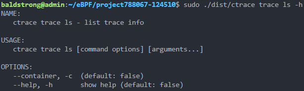

- [trace功能测试](#trace%E5%8A%9F%E8%83%BD%E6%B5%8B%E8%AF%95)
  - [help](#help)
  - [跟踪](#%E8%B7%9F%E8%B8%AA)
- [config功能测试](#config%E5%8A%9F%E8%83%BD%E6%B5%8B%E8%AF%95)
- [其他测试](#%E5%85%B6%E4%BB%96%E6%B5%8B%E8%AF%95)

# trace功能测试

## help

`sudo ./dist/ctrace help`

`sudo ./dist/ctrace trace help`

`sudo ./dist/ctrace trace ls help`

`sudo ./dist/ctrace config help`

## 跟踪

`sudo ./dist/ctrace trace --comm bash` 只跟踪bash进程

`sudo ./dist/ctrace trace --event openat` 只跟踪openat事件

`sudo ./dist/ctrace trace --set fs`  只跟踪文件系统相关事件

`sudo ./dist/ctrace trace --set net`  只跟踪网络相关事件

`sudo ./dist/ctrace trace --set fs --ee read`   只跟踪文件系统相关事件，但不包括read事件

`sudo ./dist/ctrace trace --event sys_enter --comm bash`   跟踪bash进程的所有系统调用

`sudo ./dist/ctrace trace --event sys_enter --exclude-comm bash`   跟踪所有系统调用，但不包括来自bash进程的

`sudo ./dist/ctrace trace --event sys_enter --exclude-set fs`   跟踪所有系统调用，但不包括文件系统相关事件

`sudo ./dist/ctrace trace ls -c`  实现docker ps，列出所有正在运行的容器

# config功能测试

`sudo ./dist/ctrace config --set output-format=json` 更改配置文件，输出格式设置为json

`sudo ./dist/ctrace config --set events-path=~/ctrace_output/events.json`设置事件输出文件路径

# 其他测试

TBD
